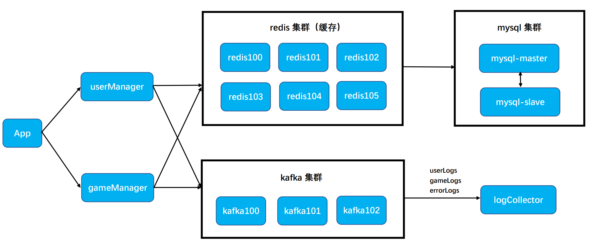
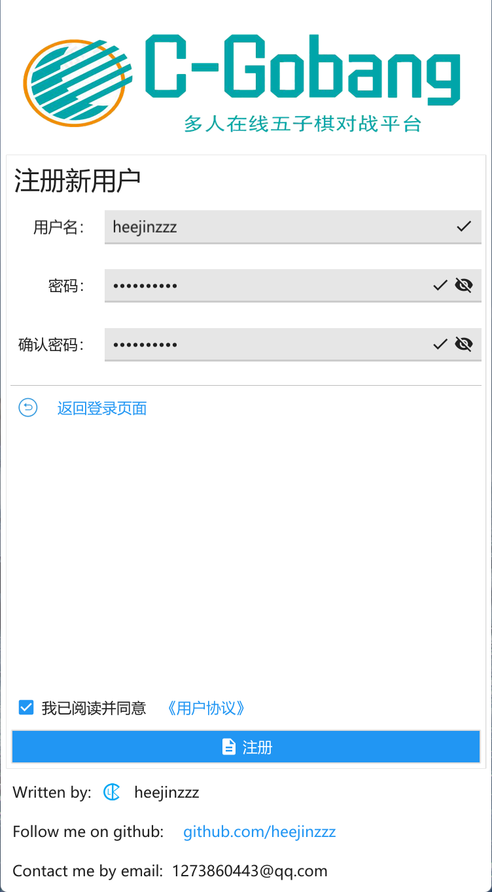
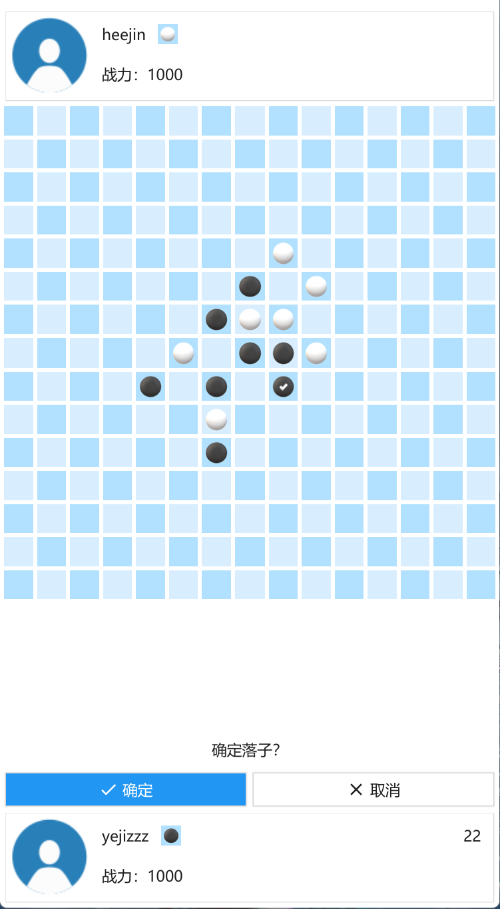

# C-Gobang
**C-Gobang：完全基于 Go 语言编写的多人实时五子棋对战游戏。**

* 服务端采用基于 grpc 的拆分式微服务架构，使用 docker compose 部署。
* 客户端使用由 Go 语言编写的开源 GUI 框架 [fyne](https://github.com/fyne-io/fyne) 编写跨平台客户端。


目录结构说明：

```
    |———— C-Gobang              # 根目录
        |———— App               # 客户端程序
        |———— dockerVolumes     # 容器卷数据
        |———— gameManager       # 对局管理服务端程序
        |———— userManager       # 用户管理服务端程序
        |———— logCollector      # 日志收集服务端程序
```

具体架构见 [附录1.1 - C-Gobang 服务端架构](#hover)

---

## 0. 直接使用
点击链接 [C_Gobang.apk 下载](https://pan.baidu.com/s/11_j83PQ9tCPPgVge9adINg?pwd=os1i)，下载 C_Gobang.apk 文件并安装到安卓设备上，直接开始使用 C-Gobang App。

> 注：当前服务器可能会因过期而停止服务。对此，可以根据下述步骤部署自己的 C-Gobang 服务端，并编译生成与之配套的 C-Gobang 客户端。

## 1. 部署 C-Gobang 服务端（On Linux）
### ( 1 ) 安装 docker engine
参考：[Install Docker Engine](https://docs.docker.com/engine/install/)
### ( 2 ) 安装 docker-compose
参考：[Install Compose](https://docs.docker.com/compose/install/linux/)（推荐安装版本：v2.7.0）
### ( 3 ) 执行命令：
```shell
git clone https://github.com/heejinzzz/C-Gobang.git
cd C-Gobang
bash deploy.sh 
```
至此，C-Gobang 服务端部署完成。

---
#### <a id="hover" style="text-decoration:none">( 附录1.1 ) C-Gobang 服务端架构</a>


> userManager、gameManager 是基于 grpc 架构的微服务。
> 
> 图中每个服务实例都基于一个 docker 容器部署。

---
#### ( 附录1.2 ) C-Gobang 服务实例相关配置
| 服务实例 | 登录用户名 | 登录密码 |
| :---: | :---: | :---: |
| mysql-master | root | 518315 |
| mysql-slave | root | 518315 |
| protainer | admin | 000000000000 |

> 各个服务实例的端口号可以在 docker 或者 portainer 中查看端口映射。

---
## 2. 编译生成 C-Gobang 客户端
### ( 1 ) 确保完成安装 fyne 所需的前置条件
参考：[Prerequisites of installing fyne](https://developer.fyne.io/started/#prerequisites)
### ( 2 ) 执行命令安装 fyne cmd 工具：
```shell
go install fyne.io/fyne/v2/cmd/fyne@latest
```
### ( 3 ) 执行命令获取源码：
```shell
git clone https://github.com/heejinzzz/C-Gobang.git
cd C-Gobang/App
go mod tidy
```
### ( 4 ) 修改服务端地址：
将 C-Gobang/App/config.go 中的
```go
ServerIP = "127.0.0.1"
```
中的 127.0.0.1 修改为你部署的 C-Gobang 服务端所在的服务器IP。
### ( 5 ) 编译生成 C-Gobang 客户端：
##### (a) 执行命令，编译生成运行在 windows 系统的 C-Gobang.exe :

    fyne package --name C-Gobang --os windows --icon icon.png

##### (b) 执行命令，编译生成运行在 android 系统的 C_Gobang.apk :

    fyne package --name C-Gobang --os android --appID com.heejinzzz.C_Gobang --icon icon.png

##### (c) 执行命令，编译生成运行在 ios 系统的 C_Gobang.app :

    fyne package --name C-Gobang --os ios --appID com.heejinzzz.C_Gobang --icon icon.png

---
#### ( 附录2.1 ) C-Gobang 客户端效果预览图
##### 注册页面：


---
##### 创建对局页面：


---
##### 对局页面：

